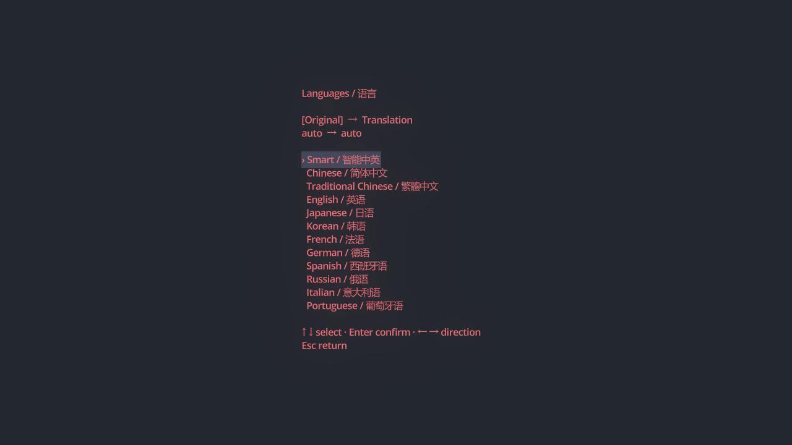

# GriddyTranslate

把 GriddyCode 的文字画布改成翻译器：保留泛光、字体、镜头聚焦和滑入设置，通过快捷键操作，打开即可输入。

A keyboard-first translator forked from [GriddyCode](https://github.com/face-hh/griddycode), retaining its canvas, glow, animated panels and camera focus. Windows portable app with Youdao and MyMemory.

## 下载与运行

前往 [Releases](https://github.com/Misaka08056/GriddyTranslate/releases/latest)，下载 **GriddyTranslate-Windows.zip**，解压整个文件夹，再双击 **GriddyTranslate.exe**。

无需安装 GriddyCode、Godot、Python 或 Codex。需要 Windows 10/11 64 位、支持 Vulkan 的显卡及正常驱动；翻译和例句需要联网。运行时、资源包和 Lua DLL 必须与启动器放在同一目录。

## 操作

| 快捷键 | 作用 |
| --- | --- |
| Ctrl + Enter | 翻译 |
| Ctrl + Tab | 原文 / 译文切换 |
| Ctrl + , | 设置 |
| Ctrl + O / Ctrl + L | 选择语言 |
| Ctrl + T | 选择主题 |
| Ctrl + Shift + C | 复制译文 |
| Ctrl + 加号 / 减号 / 0 | 放大 / 缩小 / 恢复缩放 |
| F11 | 全屏 / 窗口切换 |
| Esc | 收起面板 / 返回原文 |

设置包含有道与 MyMemory 翻译来源、英译中例句、原文保留与下一行译文、泛光与 Shader、屏幕晃动、动画速度、缩放和全屏。

例句查询保留完整单词或短语，只显示包含对应词或完整短语的真实词典例句；长句与没有完整词条的输入不显示例句。例句先以乱码逐字出现，再恢复为英文和中文。语言列表按内容居中，并适配窗口与全屏。



详细操作见 [使用说明](src/使用说明.md)，已知问题的原因与修复见 [修复说明](docs/修复说明.md)。

原文和译文仅保存在内存中，关闭应用后不会保留。偏好设置存放在 `%APPDATA%\Godot\app_userdata\GriddyTranslate\translator.cfg`。翻译请求会将文本发送给选中的服务；例句查询会发送完整词或短语给相应词典。有道公开体验接口及 MyMemory 免费服务的额度和可用性由服务方决定。

## 源码与构建

Godot 项目位于 `src/`，可用 Godot **4.2.2** 打开 `src/project.godot`。`src/Original/` 保留对照用的原版场景、脚本和插件，使用 `.gdignore` 排除导入。

Windows 构建需要 MinGW-w64 的 `gcc.exe` 已在 PATH 中。先准备固定版本的 Godot 和已验证的运行时模板，再运行构建脚本：

```powershell
.\setup-build.ps1
.\build.ps1
```

`setup-build.ps1` 从 Godot 官方发布下载 4.2.2，并从本项目首个 Release 提取运行时模板。脚本使用项目相对路径。构建会验证导出的应用，然后生成 `packages/GriddyTranslate-Windows.zip`。详见 [构建说明](tools/README.md)。

## 来源与许可

直接基于 [face-hh/griddycode](https://github.com/face-hh/griddycode) v1.2.2，原始提交 `4fb81e9d9e5974ee0c953998f27933042ed82f31`，原作者 FaceDevStuff / face-hh。GriddyTranslate 是个人维护的翻译分支。

保留原项目的 [Apache-2.0 许可](LICENSE) 和署名；Godot、LuaAPI 和字体等第三方组件的许可见 [tools/licenses](tools/licenses)。
